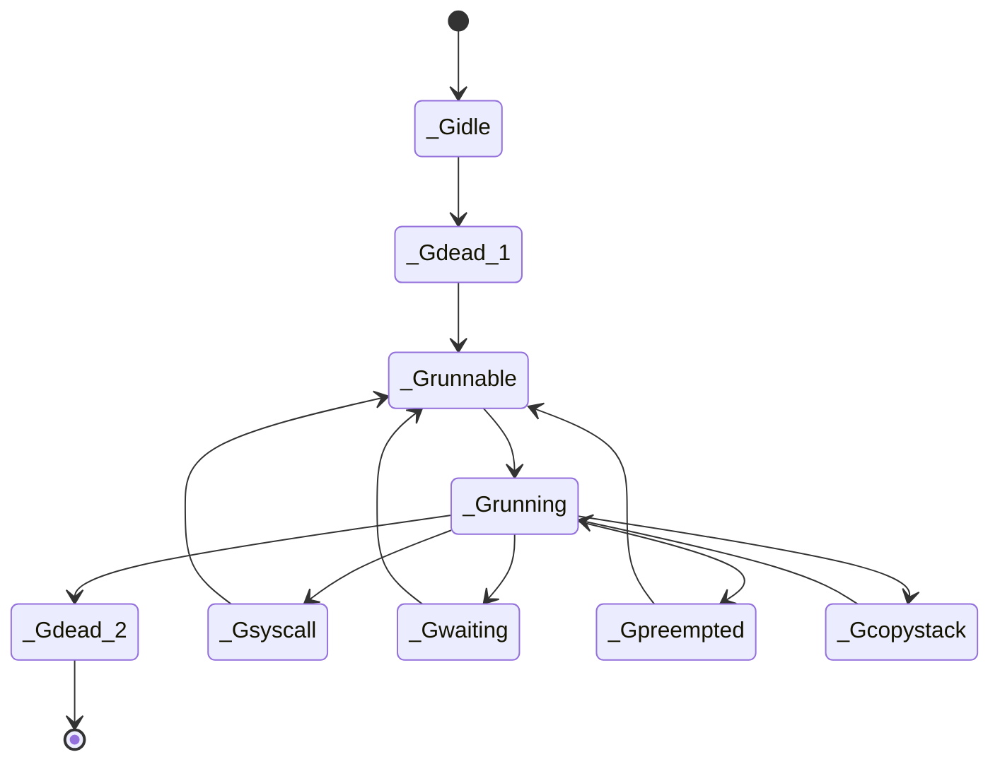

# 深入Go语言编译器

经典的编译理论中，一般将编译器分为三个阶段，称为三阶段编译器（three-phase compiler）：
* 前端：扫描解析源程序并进行精准的语义表达；
* 中间阶段：使用多个IR阶段，多种数据结构表示代码，并进行多次优化；
* 后端：生成特定目标机器上的程序；

Go语言编译器的执行流程，可细分为一下阶段：
* 词法解析；
* 语法解析；
* 抽象语法树构建；
* 类型检查；
* 变量捕获；
* 函数内联；
* 逃逸分析；
* 闭包重写；
* 遍历函数；
* SSA生成；
* 机器码生成；

# 浮点数设计原理与使用方法

## IEEE-754浮点数标准
IEEE-754规范使用以2为底的指数表示小数，这和使用以10为底数的指数表示法（即科学记数法）非常类似。
IEEE-754的浮点数存在很多精度，高级语言中一般使用两种精度：
* 32位的单精度浮点数：6-8位精度；
* 64位的双精度浮点数：15-17位精度；

Go语言中的浮点数：
* 既然浮点数不能准确表示十进制数值，为什么Go语言中的fmt.Println能够准确打印：fmt.Println打印之前，先将其转换为最接近的十进制值；
* 加法运算需要进行指数调整，因此存在丢失精度的风险。因此涉及加、减、乘、除运算时，建议优先执行乘除；

## Go语言中的数值
在Go语言中，有几个特殊数值：
* +Inf：正无穷；
* -Inf：负无穷；
* NaN：无效数值；

如果需要高精度计算，可以考虑使用如下库：
* big.Int
* big.Float
* big.Rat

# 类型推断全解析

# 常量与隐式类型转换

## 常量
常量的规范：
* 整数常量：至少存储256位；
* 浮点数常量：至少使用256位保存小数，至少使用16位保存指数；由于溢出无法表示浮点数/复数常量，则报错；由于精度限制无法表示浮点数，四舍五入表示为最接近的常量；

Go语言禁止对常量进行取地址的操作；

## 隐式类型转换
Go语言中，变量之间没有隐式类型转换，不能类型之间只能强制转换。但是编译器可以进行常量和常量、常量和变量之间的隐式类型转换：
* 有类型的优先于无类型的；
* 当两个无类型的进行运算时，结果类型的优先级为：整数（int）< 符文数（rune）<浮点数（float）<复数（imag）

# 字符串的本质与实现

## 字符和字符串
字符和字符串属于两种类型：
字符（rune）：int32的别称，range轮询时的类型为rune；
字符串（string）：不可变的UTF8编码的字节，for循环时的类型为byte；

## 字符串的实现
Go语言使用如下实现表示字符串
```go
type StringHeader struct {
	Data uintptr
	Len int
}
```

常量字符串的解析：
* 双引号内的常量字符串，需要计算转义；
* 单撇号内的常量字符串，不需要考虑转义；

字符串的拼接：找到一个空间，可以容纳拼接后的字符串，并且复制原始字符串。

字符串和字节数组的转换：涉及到复制。当字符串大于32个字节时，还需要申请堆内存。


# 数组
Go语言中的数组，具有如下特点：
* 不能进行扩容；
* 在复制和传递时，为值赋值；

其底层实现如下：
```go
type Array struct {
	Elem *Type
	Bound int64
}
```

# 切片的使用方法和底层原理

## 切片的实现
切片的底层数据结构如下：
```go
type SliceHeader struct {
	Data uintptr // 切片元素对应的底层数据元素的地址
	Len int      // 切片中元素的数目
	Cap int      // 从切片的开始位置，到底层数组的结尾位置长度
}
```

## 切片的使用
* 切片的截取：切片被截取后，仍然指向原始切片的底层数据；
* 切片的复制：切片的复制其实是对SliceHeader结构的值复制，不会改变底层的数据源；如果不想和旧数据共享数据源，可以使用copy函数；
* 切片的收缩：append可以添加新的元素到切片的末尾，它可以接受可变长度的元素，并且可以自动扩容；

# 哈希表与Go语言实现机制

## 哈希碰撞和解决办法
哈希碰撞的主要解决办法：
* 拉链法：使用额外的存储保存指针，并且元素的存储地址不连续，导致增加哈希表大小，无法高效利用CPU高速缓存；
* 开发寻址法：具有良好的CPU高速缓存利用率和高性能；

## map的基本操作
map为nil时，存在如下特点：
* 可以读取；
* 不能写入，如果写入则panic；

map的并发冲突：
* 可以并发读取；
* 不能并发读写，如果并发读写则panic：Go语言为了保证大多数场景下的查找效率，不允许并发读写map；

## key的比较
* slice，map，function不能比较；
* array，struct，interface是否能比较，取决于具体的值；
* 其它数据类型，可以比较，例如：指针、通道等；

## 哈希表底层结构
哈希表的定义如下：
```go
type hmap struct {
	count int                 // map元素的个数
	flags uint8               // map状态，例如是否写入
	B uint8                   // map桶的数量 = 2^^B
	noverflow uint16          // 溢出的桶的数量
	hash0 uint32              // 生成hash的随机数种子
	buckets unsafe.Pointer    // 指向当面map对应的桶
	oldbuckets unsafe.Pointer // 指向map扩容时的旧桶
	nevacuate uintptr         // 标记map扩容时旧桶数据转移状态，旧桶小于nevacuate的数据都已经转移到新桶中
	extr *mapextra            // map中溢出桶
}

// bmap代表桶，在运行时只列出了key的哈希值前8位：
type bmap {
	tophash [bucketCnt]uint8
}

// 编译后，对应的数据结构大致如下（伪代码）：
type bmap {
	topbits [8]uint8
	keys [8]keytype
	values [8]valuetype
	pad uintptr
	overflow uintptr
}
```

备注：
* key/value分开存储，是为了在字节对齐时压缩空间；

## 哈希表原理
哈希表的一些操作如下：
* 插入数据时，当指定桶中的数据超过8个时，不会开辟一个新桶，而是将数据放到溢出桶；
* 删除数据时，tophash重的指定位置会存储emptyOne（当前位置为空），如果之后的元素都是空的，则存储emptyRest；
* map桶重建的时机：负载因子超过6.5（双倍重建）；溢出桶的数量过多（等量重建）；

# 函数与栈

## 函数闭包
函数闭包中，可以引用外部变量val。由于是引用，因此访问时会获取val地址中的值，即最后放入其中的值，而不是遍历所有值

## 栈扩容与栈转移
栈管理的两个问题：
* 栈扩容：函数序言阶段，判断是否需要对栈进行扩容；
* 栈调整：栈扩容时，需要：将协程状态设置为Gcopystack，以便在垃圾回收状态下不会扫描该协程栈带来错误；复制栈，如果栈中包括指针，则需要调整；

# defer延迟调用

延迟调用的策略：
* 可能调用多次的defer，采用堆分配；
* 最多调用一次的defer，go 1.13采用栈分配；
* 最多调用一次的defer，go 1.14采用内联优化，从而达到和直接调用差不多的性能：通过在栈中初始化1字节的临时变量，以位图的形式来判断函数是否需要执行；

# 异常与异常捕获

## panic与recover使用方法
使用方法：
* 即使有多个panic函数，最上层的函数只需要一个recover函数就能进入正常流程；
* 内层函数的recover，不能捕获外层函数的panic

## panic与recover底层原理
panic的底层原理：
* 每个协程有panic链，每次调用panic时，就会往链上添加panic结构体；
* panic简单遍历协程中所有的defer，并通过反射的方式调用defer中的函数：gopanic函数的栈帧大小固定而且很小，可能没有足够的空间来存放defer函数的参数，通过反射来调用时不需要准备参数；

# 接口与程序设计模式

## 接口的使用
Go语言中有两种接口：
* 带方法签名的接口;
* 空接口;


## 接口底层原理

接口存在一定的性能损失：
* 接口的方法调用，需要构造接口对象，并寻找函数指针；
* 接口的data字段，存储的是接口中具体值的指针，因此接口会复制原始值，并导致内存逃逸，内存回收；

### 带方法签名的接口
带方法签名的接口，定义实现如下：
```go
type iface struct {
	tab *itab           // 类型信息
	data unsafe.Pointer // 数据信息，例如：动态类型的数据信息
}

type itab struct {
	inter *interfacetype  // 接口类型
	_type *_type          // 动态类型
	hash uint32           // 动态类型的唯一标识，是_type字段中hash的副本
	_ [4]byte             // 填充字段
	fun [1]uintptr        // 动态类型中的函数指针列表，用于运行时接口调用动态函数
}

type interfacetype struct {
	typ _type      // 类型信息
	pkgpath name   // 接口所在包名
	mhdr []imethod // 接口中暴露的方法在最终可执行文件中的名字和类型的偏移量
}
```

接口动态调用时，先找到接口，再通过偏移量找到要调用的函数指针。


### 空接口
空接口的定义如下：
```go
type eface struct {
	_type *_type        // 动态类型信息
	data unsafe.Pointer // 动态数据信息
}
```

# 反射高级编程

## 反射的基本使用方法
反射的定义如下：
* reflect.Value可以看成反射的值，是一个结构体，内部包含很多方法；
* reflect.Type可以看成反射的实际类型，是一个接口，包含和类型有关的很多方法签名；
对应的定义如下：
```go
type Type interface {
	Align() int
	FieldAlign() int
	Method(int) Method
	MethodByName(string) (Method, bool)
	String() string
}
```

反射之间的相互转换：
* interface{}可以转化为reflect.Value, reflect.Type；
* reflect.Value可以转换为interface{}；
* reflect.Value可以转换为reflect.Type；

反射的方法：
* Elem(): reflect.Value返回指针和接口指向的数据；reflect.Type获取各种类型（指针、接口、数组、通道、切片、哈希表等）指向的类型；
* Set(): reflect.Value的Set方法，可以修改反射的值；
* NumField(), Field(): 配合使用reflect.Type.NumField, reflect.Value.Field()，可以遍历结构体字段；
* NumMethod(), Method(): 配合使用reflect.Type.NumMethod, reflect.Type.Method()，可以遍历结构体字段；
* MethodByName(): reflect.Value.MethodByName返回对应方法；
* Call(): 函数/方法的reflect.Value对象，具有Call方法；
* XXXOf(): reflect.XXXOf方法，可以构造特定的reflect.Type，例如struct, array, chan, pointer, slice, map, func；
* MakeXXX(): reflect.MakeXXX方法，可以构造特定类型的reflect.Value，例如chan, func, map, slice；
* New(): reflect.New方法，根据反射的类型，分配相应大小的内存；

## 反射的底层原理
反射的底层原理：
* reflect.TypeOf：将接口变量参数转化为实际空接口emptyInterface，并获取空接口的类型值；
* reflect.ValueOf: 存储接口的值、类型，以及flag标志
  flag的意义如下：
   * 低5位：类型标志，和kind对应；
   * 低6-10位：字段的特征，例如：
      * flagStickyRo: 结构未导出的字段，不是嵌入的字段；
	  * flagEmbedRO: 结构未导出的字段，是嵌入的字段；
	  * flagIndir: 间接的；
	  * flagAddr: 可寻址；
	  * flagMethod: 该值位method；
	  * flagRO: 结构未导出的字段；
   * 其余位：方法的index序号，代表第几个方法；
* relfect.Value.Elem：对于指针来说，如果flag标识了reflect.Value是间接的，则返回数据真实地址，否则返回本身，并且会将flag修改位flagAddr；
* reflect.Value.Call: 其参数、返回值都是reflect.Value数组，流程如下：
   1. 获取函数/方法指针；
   1. 进行有效性验证；
   1. 调用funcLayout函数，用于构建函数参数以及返回值的栈帧布局，其中：
      * frametype: 调用时需要的内存大小；
	  * retOffset：函数参数以及返回值在内存的位置；
	  * framePool：内存缓存池，用于没有返回值的场景中复用内存；
   1. 构建参数：例如方法接收者，输入参数；
   1. 调用汇编代码完成待用逻辑，需要传递的参数包括：内存布局类型frametype, 函数指针fn, 内存地址args，栈大小frametype.size, 输入参数与返回值的内存间隔retOffset；
   1. 完成调用后，如果函数没有返回，则将清空args，并放入到framePool中；如果有返回值，则清空args中输入参数部分，并将输出包装位ret切片后返回；

# 协程初探

## 线程上下文切换
当发生线程上线文切换时，需要从操作系统用户态转移到内核态，记录上一个线程的重要寄存器值、进程状态等信息，将这些信息保存在操作系统线程控制块（Thread Control Block）中。
当切换到下一个要执行的线程时，需要重新加载重要的CPU寄存器值，并从内核态转移到用户态。
如果线程属于不同的进程时，还需要更新额外的状态信息、内存地址空间，同时将新的页表（page tables）导入内存。

## 线程和协程
线程和协程的区别：
* 调度方式：线程通过内核调度，协程通过Go语言运行时的调度器调度，属于用户态；
* 调度策略：线程大部分时间是抢占式的，协程一般情况下是协作式调度，只有运行很长时间时，才会被强制抢占；
* 上下文切换：协程上下文切换速度较快：不用经过用户态/内核态的切换；保存的状态、寄存器值较少；
* 栈的大小：线程栈大小在创建时指定，默认相对较大；协程栈大小可以自动调整，默认值为2K，很小；

## 主协程和子协程
main函数对应的协程叫做主协程，它和其它子协程的区别：主协程退出时，程序自动退出

## GMP模型
GMP的含义：
* G：Goroutine，应用程序级别的线程，轻量级的线程；
* M：Machine，操作系统的线程；
* P：Process，处理器；

GMP之间的关系：
* 任意时刻，一个P只能绑定一个M，并且包括多个本地G；
* M不是固定的绑定在一个P上，可以转移到其它P；
* M可以不和任何P绑定，例如和P解绑的M进入休眠状态；
* G不是固定的绑定在一个P上，可以转移到其它P；
* G可以不和任何P绑定，例如全局队列中；


# 深入协程设计与调度原理

## 协程的生命周期与状态转移
协程的状态包括：
* _Gidle：刚开始创建时的状态；
* _Gdead：初始化完成，或者协程销毁时的状态；
* _Grunnable：等待运行；
* _Grunning：正在运行；
* _Gwaiting：运行时被锁定，不能执行用户代码，在垃圾回收、channel通信等情况下经常碰到这种情况；
* _Gsyscal：执行系统调用；
* _Gpreempted：被强制抢占；
* _Gcopystack：将协程中的栈转移到新栈时的状态；

对应的流程图如下（可能有错误）：


## 特殊协程g0与协程切换
每个m都有一个特殊协程g0:
* g0运行在操作系统线程栈上，并且可以重复使用该栈，其它协程使用协程栈；
* g0执行固定的调度代码，其它协程执行用户代码；

协程调度流程：
* 将当前协程g1执行上下文切换的需要的信息保存到g.gobuf中；
* 执行特殊协程g0；
* g0选择协程g2，并调度执行；

## 线程绑定
Go语言运行时的调度器，使用线程本地存储将操作系统的线程与代表线程的m结构体绑定在一起，m.tls[0]保存当前线程正在运行的协程g；

## 调度循环
循环调度的过程：
* g0到g
   1. schedule：选定需要执行的协程；
      1. 执行下一个要执行的协程：runnext；
	  1. 执行局部队列中的协程：每执行61次调度，则优先从全局队列中获取一个g到当前p中；
	  1. 执行全局队列中的协程；
	  1. 执行准备就绪的网络协程；
	  1. 窃取其它P局部队列中的协程；
	  1. M和P解除绑定：P放入空闲队列，M进入休眠状态；
   1. execute：执行一些具体的状态转移、g与m之间的绑定等操作；
   1. gogo：执行操作系统相关的函数，完成栈的切换以及CPU寄存器的恢复；
* g到g0:协程g调用mcall保存当前协程的执行现场后，切换到g0，调度的时机包括：
   * 主动调度：用户代码中执行runtime.Gosched，系统解除G与M之间的绑定关系，并将G放到全局队列；
   * 被动调度：执行某些操作需要暂停时，被动让渡执行的权利，系统解除G与M之间的绑定关系，并将G设置为_Gwaiting状态；
   * 抢占：运行时间较长，或者处于系统调用阶段，系统强制抢占；

执行时间过长的抢占调度时机，需要满足下述任意条件：
* 执行时间超过10ms

执行时间过长的抢占调度的流程：
* 监控线程发送sigPreempt信号（Unix中的SIGURG信号）；
* 协程捕获sigPreempt信号，进入信号处理流程，并调用doSigPreemtpt函数：修改rsp、rip等寄存器中的值，从而确保进入正常流程后，进入asyncPreempt；
* 协程进入正常流程，执行asyncPreempt：保存当前协程的寄存器值，并调用asyncPreempt2。asyncPreempt2根据preemptPark函数或者gopreempt_m函数重新切换回调度循环；

系统调用的抢占调度时机，需要满足下述任意条件：
* 当前局部运行队列中，有等待运行的g；
* 当前没有空闲的P和自旋的M；
* 当前系统调用时间超过10ms；

系统调用的抢占调度结果：
* 满足下述任意条件，启动一个M来接管P；
   * 本地运行队列中，有等待运行的G；
   * 需要处理垃圾回收的后台任务；
   * 所有其它P都在运行G，并且没有自旋的M；
   * 全局运行队列不为空；
   * 需要处理网络socket读写等事件；
* 不满足上述条件，则将当前P放入到空闲队列；

系统调用的抢占调度注意事项：
* 在调度前执行函数reentersyscall，保存当前G的执行环境，并解除P与M之间的绑定，并将p放到oldp中；
* 从系统调用返回后，调用exitsyscall函数，寻找对应的P：
   * 优先尝试能否绑定之前的oldp；
   * 从全局队列寻找空闲的P；
   * 将G放到全局运行队列；

Go语言在一个独立的M上运行监控线程，不需要绑定逻辑处理器P，其任务包括：
* 检测是否有准备就绪的网络协程，并放置到全局队列；
* 判断协程是否运行时间过长，或者处于系统调用阶段。如果是，则抢占执行；
